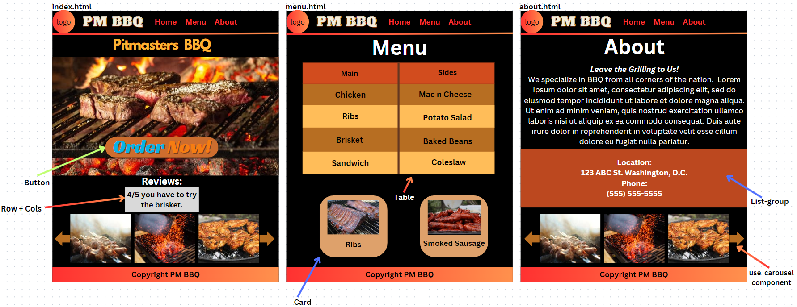

<h1>Demo website for Pitmasters Back Alley BBQ</h1>

<h2>About</h2>

  This is my first Bootstrap Project based off a fake E-Commerce website for Pitmasters Back Alley BBQ. It's loosely modeled after the real restaurant. It follows along with my first HTML and CSS projects. It has three pages - home, menu, and about. It features a table with fictitious prices, and a list of contact information. It also includes images on each page.

<h2> Wireframe </h2>

 This is my plan for the website using HTML, CSS, and Bootstrap. The wireframe was created on Canva.com

<h2>Technology used</h2>

  The project uses HTML, CSS and Bootstrap to structure and style the website.

<h2>Credits and Acknowledgements</h2>

  The photos were downloaded from the Pitmasters website,unslpash.com, and pexel.com

  Parts of the CSS and HTML were referenced from w3schools and MDN.

<h3>Photo Credits</h3>

<ul>
  <li>
    Logo and Hero Image : <a href="//pitmastersbackalleybbq.com">Pitmaster BBQ</a>
  </li>
</ul>

<h3>Code Credits</h3>

<ul>
  <li>
    Hero Image : <a href="https://imagekit.io/blog/css-image-overlay/">CSS Image Overlay</a>
  </li>
  <li>
    Making a Navbar with a ul : <a href="https://www.w3schools.com/css/css_navbar.asp">W3S Navbar</a>
  </li>
</ul>
